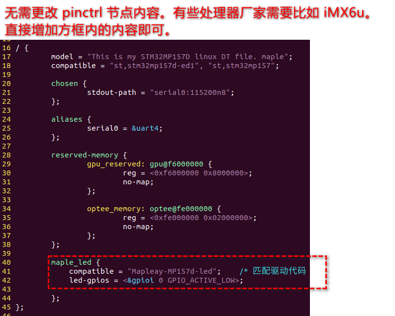
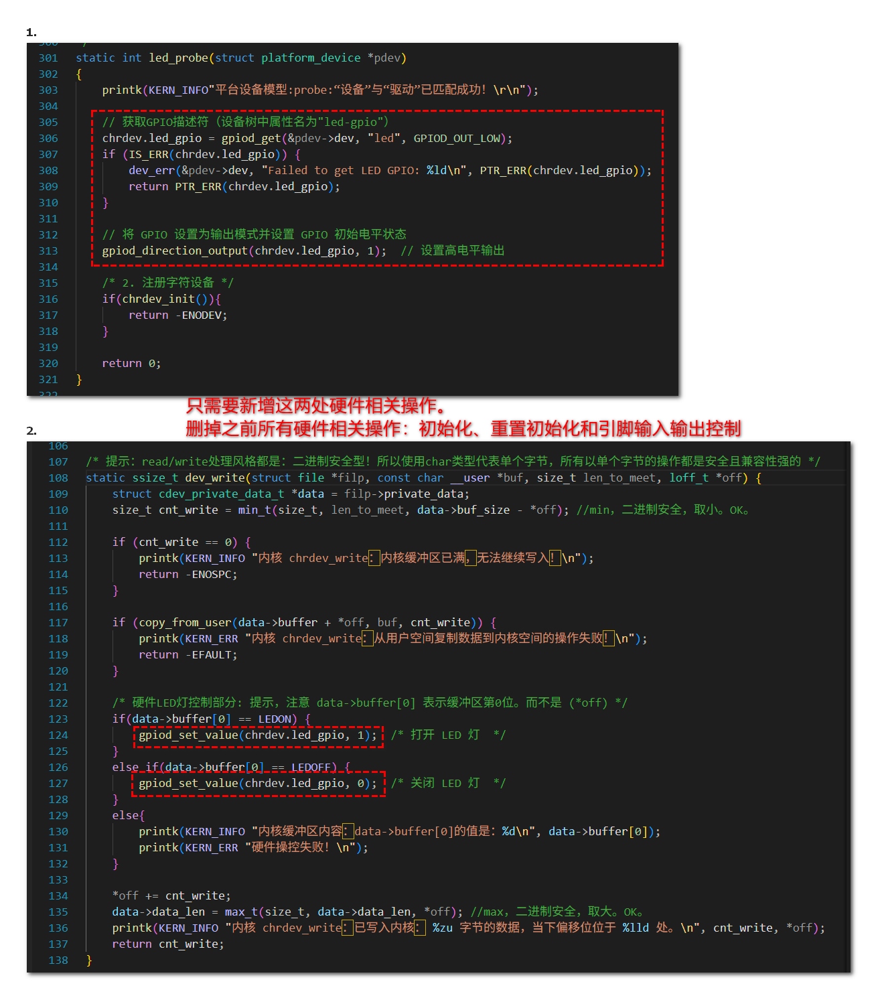

## 实操感悟：

> 字符设备

字符设备驱动框架，是个独立的内核子系统，原生数据结构是 cdev

> 设备模型

设备模型是内核管理硬件的主要对象子系统，它最早将硬件设备信息和软件驱动，划分为：总线、设备、驱动。

> 平台设备模型

平台设备模型，是派生自设备模型的，主要适用于嵌入式这种典型的个性化硬件繁杂的需求场景。
USB总线、PCIe总线是设备模型原生支持的正统的物理总线，支持特性全面且成熟。
平台设备总线也是设备模型的一种总线类型，他是一条虚拟总线，地位等同于兄弟总线：USB总线、PCIe总线。
平台设备模型，继承了挂载在同条总线下主动匹配设备与驱动的特性，但是

1. 与兄弟总线相比，平台设备模型不支持硬件探测特性，也就是说兄弟支持热插拔，而它自己不行。
   - 设备树的引入内核，可以被内核解析利用并生成platform_device设备，可与平台驱动匹配，可等价替换设备C文件；
   - 设备树的引入，某种程度上增强了硬件的可探测性，也使得内核中的子系统们，可以更加方便使用设备树。
2. 平台设备模型提供了，一旦设备与驱动匹配成功，就调用注册号的probe函数，进行自定义初始化机制。这种机制十分灵活，可以在probe总做任何事情，也可以实现基于平台设备模型的多级树形逻辑匹配嵌套。利用此机制可以：
   - 自定义业务逻辑操作；
   - 注册字符设备、注册 pinctrl 子系统等；
   - 等等等等等；

> 设备树

设备树提供的硬件信息的使用模式：

1. 直接由linux驱动工程师，在内核驱动程序中，利用设备树接口，直接获取一手硬件参数，然后自己配置硬件；
2. 在编写linux内核驱动时，不直接操作硬件寄存器，而是利用相关配套子系统，比如 pinctrl 和 GPIO 子系统去操控硬件；

> pinctrl 与 GPIO 子系统新旧版本对比

旧版本依赖，传统板级文件（Board File），在设备树普及之前（如 Linux 2.6 时代），硬件信息通过 C 代码硬编码在板级文件中（如 mach-xxx 目录）。配置方式：
	GPIO：通过 gpio_request() + gpio_direction_output() 等函数直接操作 GPIO 编号。
	Pinctrl：通过平台数据（platform_data）静态定义引脚复用和配置。
缺点：代码臃肿：硬件信息与驱动耦合，移植性差。维护困难：每次硬件变更需重新编译内核。

> pinctrl 子系统

1. pinctrl 子系统在设备树里也有关键字，用于标识他是一个独特的pinctrl高级硬件节点，非纯硬件信息的raw节点。可能更精确地说，设备树里有高级节点比如pinctrl节点，是对硬件信息的管理整合，用于向linux的pinctrl子系统提供硬件信息服务。

2. pinctrl 子系统一方面会主动解析来自设备树的硬件信息，另一方面会配合其他子系统如GPIO子系统联动工作为板级驱动工程师提供硬件控制接口。
3. SoC厂商家里的BSP工程师会整合自家芯片硬件特性，编写 pinctrl 驱动并注册到 linux pinctrl core 框架内。这样以后就能直接修改设备树相关内容，就可以由pinctrl个性化配置初始化部分硬件功能，无需人为编写相关代码。

> GPIO子系统

1. 

## stm32mp157d 的GPIOI0的LED点灯实验

验证OK 。2025年4月23日13:12:24。