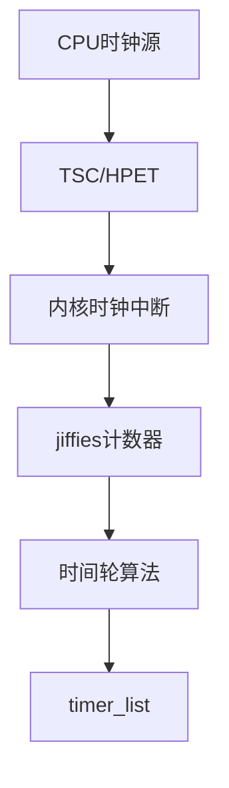
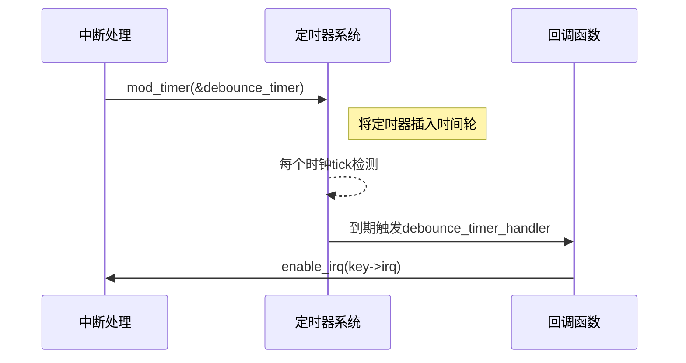

timer_setup(&chrdev.gpio_keys[i].debounce_timer, debounce_timer_handler, 0);
这个timer到底是真没鬼？他的身世？它基于什么硬件定时器？他的核心数据结构是？

### 深入解析 Linux 内核定时器的实现机制

#### 一、定时器的"身世"背景
该定时器属于 Linux 内核的 **时间管理子系统**，其核心设计目标是提供高精度、低延迟的定时服务。具体到代码中的 `debounce_timer`，它属于 **动态定时器**（Dynamic Timer）类别，与传统实时操作系统的定时器有本质区别。

#### 二、硬件基础架构


1. **硬件依赖层级**：
   - 一级时钟源：TSC（Time Stamp Counter）、HPET（High Precision Event Timer）
   - 二级抽象层：`clocksource` 框架（/sys/devices/system/clocksource）
   - 三级驱动层：`CONFIG_HZ` 配置决定基准频率（通常 100-1000Hz）

2. **精度控制机制**：
   - 低精度模式：基于 `jiffies` 的粗粒度计时（1ms @1000Hz）
   - 高精度模式：`hrtimer` 的纳秒级精度（需要硬件支持）

#### 三、核心数据结构解剖
`timer_list` 结构体定义（内核源码节选）：
```c
struct timer_list {
    struct hlist_node entry;
    unsigned long expires;          // 到期时间（jiffies单位）
    void (*function)(struct timer_list *); // 回调函数指针
    u32 flags;                     // 状态标志位
#ifdef CONFIG_LOCKDEP
    struct lockdep_map lockdep_map;
#endif
};
```

关键成员详解：
| 成员       | 位宽   | 作用                                                         |
| ---------- | ------ | ------------------------------------------------------------ |
| `entry`    | 64-bit | 用于挂接到时间轮哈希表的节点                                 |
| `expires`  | 64-bit | 绝对超时时间（基于jiffies的偏移量）                          |
| `function` | 64-bit | 回调函数指针，需遵循 `void (*)(struct timer_list *)` 的函数签名 |
| `flags`    | 32-bit | 控制位（如：TIMER_MIGRATING表示定时器正在CPU间迁移）         |

#### 四、定时器工作流程
以您的按键去抖动场景为例：


关键阶段说明：
1. **定时器初始化**：`timer_setup` 填充回调函数和上下文
2. **激活定时器**：`mod_timer` 将定时器挂入时间轮
3. **时间轮检测**：每个时钟中断（tick）扫描到期定时器
4. **软中断触发**：通过 `TIMER_SOFTIRQ` 软中断执行回调
5. **资源清理**：单次定时器自动移除，周期性需重新激活

#### 五、硬件映射关系
您的 `debounce_timer` 实际上使用的是 **虚拟化定时器资源**：
1. **物理层**：依赖 CPU 的本地APIC定时器或HPET
2. **抽象层**：通过 `tick_handle_periodic` 驱动jiffies更新
3. **逻辑层**：时间轮算法管理所有活跃的 `timer_list`

性能指标对比：
| 定时器类型   | 精度范围 | CPU负载 | 适用场景             |
| ------------ | -------- | ------- | -------------------- |
| `timer_list` | 1ms-10ms | 低      | 常规延时（如去抖动） |
| `hrtimer`    | 1ns-1ms  | 中      | 多媒体/网络协议栈    |
| `RTC`        | 1秒级    | 无      | 系统唤醒             |

#### 六、调试与观测方法
1. **动态追踪定时器**：
```bash
echo 'timer:*' > /sys/kernel/debug/tracing/set_event
cat /sys/kernel/debug/tracing/trace_pipe
```

2. **查看活跃定时器**：
```bash
cat /proc/timer_list  # 需要内核配置CONFIG_TIMER_STATS
```

3. 性能统计信息：
```bash
grep "timer" /proc/vmstat  # 查看定时器相关事件计数
```

通过这种设计，即使系统中存在数万个活跃定时器，内核仍能保持高效的定时检测能力。您案例中的去抖动定时器正是受益于这种经过千锤百炼的时间管理机制。