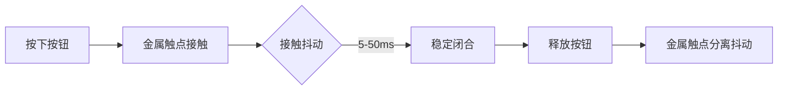

在嵌入式开发和硬件交互中，**debounce（去抖动）** 是指消除机械开关或按钮在物理接触时产生的信号抖动的技术。这种抖动会导致电气信号在短时间内（通常是毫秒级）出现多次快速的高低电平变化，从而被误判为多次有效操作。

---

### 一、抖动现象的本质
#### 机械开关的工作特性


1. **闭合抖动**：触点首次接触时产生约 **1-5ms** 的不稳定信号
2. **断开抖动**：触点分离时产生约 **10-50ms** 的不稳定信号
3. **抖动频率**：典型值为 **1-10kHz**（取决于开关质量）

---

### 二、`debounce_timer_handler` 的作用
您代码中的实现：
```c
static void debounce_timer_handler(struct timer_list *t) {
    struct gpio_pin_t *key = from_timer(key, t, debounce_timer);
    int val = gpiod_get_value_cansleep(key->gpiod);
    
    // 两次读取验证稳定性
    if (val == gpiod_get_value_cansleep(key->gpiod)) {
        input_report_key(...);
    }
    enable_irq(...);
}
```

#### 关键设计要点：
| 步骤           | 作用                               |
| -------------- | ---------------------------------- |
| **延迟检测**   | 等待抖动期结束（示例中的50ms延迟） |
| **二次验证**   | 连续两次读取电平确认稳定性         |
| **中断重启用** | 确保新的按键操作能被重新捕获       |

---

### 三、硬件 vs 软件去抖动对比
| 类型           | 实现方式                      | 优点                 | 缺点                    |
| -------------- | ----------------------------- | -------------------- | ----------------------- |
| **硬件去抖动** | RC滤波电路                    | 不消耗CPU资源        | 增加BOM成本，响应速度慢 |
| **软件去抖动** | 定时器+状态验证（如您的代码） | 灵活可调，零硬件成本 | 需要合理设置延迟时间    |

---

### 四、关键参数优化建议
1. **延迟时间选择**：
   - 普通按钮：**10-50ms**
   - 高质量密封开关：**5-10ms**
   - 工业级按钮：**20-100ms**（考虑环境干扰）

2. **采样策略优化**：
   ```c
   // 示例：三次采样验证
   int val1 = gpiod_get_value(...);
   mdelay(2);
   int val2 = gpiod_get_value(...);
   mdelay(2);
   int val3 = gpiod_get_value(...);
   
   if (val1 == val2 && val2 == val3) {
       // 有效状态
   }
   ```

---

### 五、实际测试方法
1. **示波器观测**：
   ```bash
   # 通过GPIO sysfs接口实时监控电平变化
   echo 3 > /sys/class/gpio/export
   watch -n 0.1 "cat /sys/class/gpio/gpio3/value"
   ```

2. **调试日志增强**：
   ```c
   printk(KERN_DEBUG "去抖验证: GPIO=%d 初始值=%d 二次值=%d\n", 
         key->gpio, val, gpiod_get_value(...));
   ```

---

### 六、进阶应用场景
1. **自适应去抖动**：
   ```c
   // 动态计算抖动持续时间
   static int debounce_ms = 50;
   
   if (jiffies - last_interrupt < msecs_to_jiffies(100)) {
       debounce_ms *= 2; // 连续快速操作时延长去抖时间
   } else {
       debounce_ms = 50; // 重置默认值
   }
   ```

2. **复合事件检测**：
   ```c
   // 检测长按（超过1秒）
   if (val == 1 && jiffies - press_start > HZ) {
       input_report_key(..., KEY_LONGPRESS);
   }
   ```

通过合理的去抖动设计，可以确保每个物理按键操作只被识别为一次有效事件，这是嵌入式输入设备可靠性的基石。