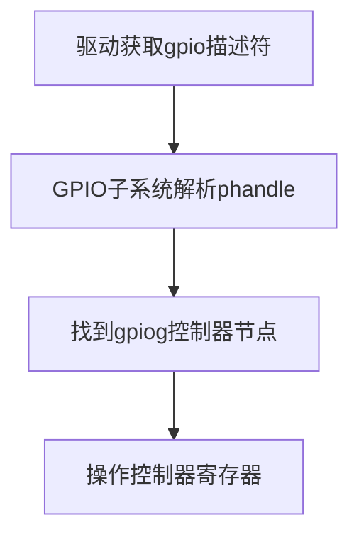

### 设备树硬件信息访问范围详解

在 Linux 设备树（Device Tree）中，**驱动只能访问与其绑定的节点及其子节点的属性**，但通过引用机制可以间接获取其他节点的硬件信息。以下是具体分析：

---

#### 一、设备树节点信息访问规则
| 访问范围         | 访问方式                                 | 示例说明                   |
| ---------------- | ---------------------------------------- | -------------------------- |
| **绑定节点属性** | 直接通过 `of_` 系列函数读取              | `of_property_read_u32()`   |
| **子节点属性**   | 通过遍历子节点获取                       | `for_each_child_of_node()` |
| **父节点属性**   | 使用 `of_node_parent()` 获取父节点后访问 | 获取总线地址等共享信息     |
| **跨节点引用**   | 通过 `phandle` 或标签引用其他节点        | `clocks = <&rcc TIMER1_K>` |
| **全局定义信息** | 访问 `/aliases` 或 `/chosen` 等特殊节点  | `of_alias_get_id()`        |

---

#### 二、您案例中的具体分析
在您提供的设备树中：
```dts
maple_keys {
    compatible = "Mapleay,keystest";
    mkey-gpios = <&gpiog 3 ...>, <&gpioh 7 ...>; 
    mled-gpio = <&gpioi 0 ...>;
};
```

##### 1. **直接访问绑定节点属性**
驱动可通过以下方式获取当前节点信息：
```c
// 获取 gpio 数量
int count = of_gpio_named_count(node, "mkey-gpios");

// 获取具体 gpio 描述符
struct gpio_desc *desc = devm_gpiod_get_index(dev, "mkey", i, GPIOD_IN);
```

##### 2. **跨节点访问示例**
虽然 `mkey-gpios` 引用了 `&gpiog` 节点，但 **驱动无需直接操作 GPIO 控制器节点**。GPIO 子系统会自动处理以下流程：


##### 3. **特殊节点访问**
若需要访问 `/aliases` 中的信息：
```c
// 获取串口别名
const char *uart_alias = of_get_property(of_root, "serial0", NULL);
```

---

#### 三、设备树信息访问限制
| 限制类型         | 说明                                                         |
| ---------------- | ------------------------------------------------------------ |
| **作用域限制**   | 只能访问绑定节点及其子节点的直接属性                         |
| **安全限制**     | 无法访问未通过 phandle 引用的其他节点                        |
| **命名空间限制** | 自定义属性名需避免与标准属性冲突（如 `mled-gpio` 应为 `led-gpios`） |

---

#### 四、最佳实践建议
1. **属性命名规范**
   ```dts
   // 推荐使用标准后缀
   led-gpios = <&gpioi 0 GPIO_ACTIVE_LOW>;
   key-gpios = <&gpiog 3 GPIO_ACTIVE_LOW>, <&gpioh 7 GPIO_ACTIVE_LOW>;
   ```

2. **跨节点引用优化**
   ```dts
   // 在绑定节点内完整定义依赖
   pinctrl-names = "default";
   pinctrl-0 = <&key_pins>;
   ```

3. **驱动代码示例**
   ```c
   static int my_probe(struct platform_device *pdev) {
       struct device_node *node = pdev->dev.of_node;
       
       // 获取当前节点属性
       int count = of_gpio_named_count(node, "key-gpios");
       
       // 通过子系统访问引用节点
       struct gpio_desc *led = devm_gpiod_get(dev, "led", GPIOD_OUT_LOW);
   }
   ```

---

#### 五、调试技巧
1. **查看节点完整信息**
   ```bash
   # 在开发板上查看解析后的设备树
   dtc -I fs /sys/firmware/devicetree/base
   ```

2. **验证驱动匹配**
   ```bash
   # 查看驱动绑定的设备节点
   ls /sys/bus/platform/devices/*/driver
   ```

通过合理利用设备树的层级和引用机制，可以在保持驱动独立性的同时，灵活描述复杂硬件关联。